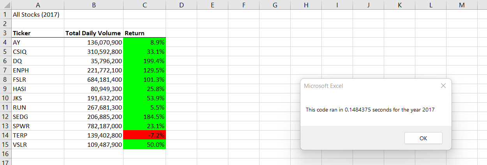
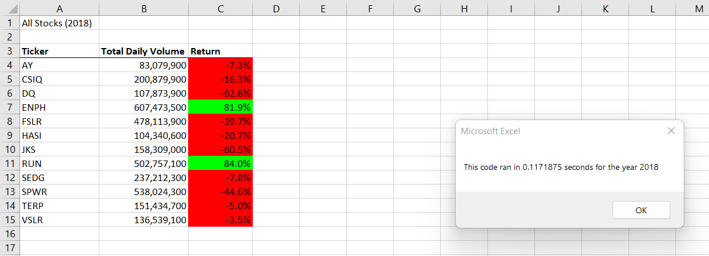

# Stock Analysis with VBA

## Overview of Project
Steve’s parents want to invest in Green Energy Stocks.  They think they want to invest all their money into DAQO New Energy Corporation (DQ).  Steve is asking for help analyzing a handful of green energy stocks in addition to DQ to help his parents make the best decision.  He has given me an excel file with stock data from 2017 and 2018 that contains 12 different “green energy” stocks to analyze. 
The purpose of this challenge was to “refactor” the code to make it more streamlined and in turn, faster.   The original code had to go through the rows of data multiple times.  The new “refactored” code only had to go through the rows of data one time.  This was accomplished by making output arrays to store data as each row was analyzed by the VBA code.  

## Results
By refactoring the code, the process was much faster.   Below are screenshots for the refactored code for both 2017 and 2018.  The refactored code was more than 80% faster than the original code! If we were to analyze a much bigger dataset, these results would really pay off!  

## Summary
### Advantages and Disadvantages of Refactoring Code
-The main advantage of refactoring the code is that the results came a lot faster.  With the size of the our dataset, the time advantage didn’t make that much of a difference.  However, this could be applied to a much larger sized dataset and then the benefits would really be noticed. <pre>
 </pre>

-The main disadvantage of refactoring the code is the time it took to refactor it! Since I am new to using VBA, it took me a very long time to get the refactored code to work.  I’m sure if I was a more advanced VBA user, this wouldn’t seem like much a disadvantage at all. 

